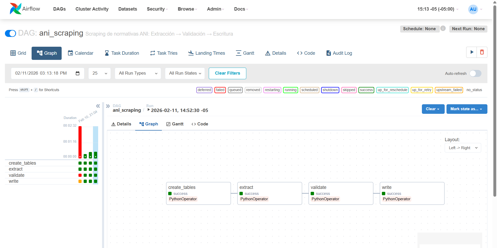

# Scraper de Normatividad ANI — Pipeline Airflow

Pipeline de datos que extrae normativas del portal de la **Agencia Nacional de Infraestructura (ANI)**, las valida y las persiste en PostgreSQL, orquestado por Apache Airflow.

## Entregables

Este repositorio cumple con los requerimientos de la prueba técnica:

| Entregable               | Archivo(s)                                                     | Descripción                                                                              |
| ------------------------ | -------------------------------------------------------------- | ---------------------------------------------------------------------------------------- |
| **Código Refactorizado** | `src/extraction.py`<br>`src/validation.py`<br>`src/writing.py` | Módulos separados para Extracción, Validación y Escritura.                               |
| **DAG de Airflow**       | `dags/ani_scraping_dag.py`                                     | Orquestación: `create_tables` → `extract` → `validate` → `write`.                        |
| **Reglas de Validación** | `configs/validation_rules.yaml`                                | Archivo YAML con tipos, regex y obligatoriedad por campo.                                |
| **Esquema DDL**          | `init.sql`                                                     | Definición de tablas `regulations` y `regulations_component`.                            |
| **README**               | `README.md`                                                    | Instrucciones de despliegue y ejecución (este archivo).                                  |
| **Logs**                 | _(Consola Airflow)_                                            | Logs detallados por etapa: conteo de extracción, descartes por validación e inserciones. |

## Arquitectura

```
Extracción → Validación → Escritura
(scraping)    (reglas YAML)  (PostgreSQL)
```

### Airflow DAG Flow



| Componente           | Archivo                         |
| -------------------- | ------------------------------- |
| Extracción           | `src/extraction.py`             |
| Validación           | `src/validation.py`             |
| Escritura            | `src/writing.py`                |
| Utilidades           | `src/utils.py`                  |
| Reglas de validación | `configs/validation_rules.yaml` |
| DAG de Airflow       | `dags/ani_scraping_dag.py`      |
| DDL de tablas        | `init.sql`                      |

## Levantar el entorno

### Requisitos previos

- Docker y Docker Compose instalados.

### 1. Construir y levantar los servicios

```bash
docker-compose build
docker-compose up -d
```

Esto levanta:

- **PostgreSQL** (puerto `5432`) — BD compartida con Airflow y destino de los datos.
- **Airflow Scheduler** — ejecuta las tareas del DAG.
- **Airflow Webserver** — UI disponible en [http://localhost:8080](http://localhost:8080).

> Las tablas (`regulations`, `regulations_component`) se crean automáticamente al iniciar PostgreSQL (`init.sql`) y también se verifican en la primera tarea del DAG.

### 2. Inicializar Airflow (primera vez)

> **Nota:** Se usa `docker-compose run --rm` en lugar de `docker-compose exec` porque en el primer arranque los contenedores de Airflow se reinician continuamente al no encontrar la BD inicializada.

```bash
docker-compose run --rm webserver airflow db init
docker-compose run --rm webserver airflow users create \
    --username admin --password admin \
    --firstname Admin --lastname User \
    --role Admin --email admin@example.com
```

Después de inicializar, reiniciar los servicios para que arranquen correctamente:

```bash
docker-compose restart scheduler webserver
```

### 3. Ejecutar el DAG

1. Ir a [http://localhost:8080](http://localhost:8080) (usuario: `admin`, contraseña: `admin`).
2. Activar el DAG **`ani_scraping`** con el toggle.
3. Hacer clic en **Trigger DAG** (▶) para ejecutar manualmente.

El DAG ejecuta secuencialmente:

1. **create_tables** — verifica/crea las tablas en PostgreSQL.
2. **extract** — scrapea las páginas del sitio ANI.
3. **validate** — aplica reglas de tipo, regex y obligatoriedad.
4. **write** — inserta registros nuevos (sin duplicados).

### 4. Verificar resultados

Los logs de cada tarea muestran:

- **extract**: `Total registros extraídos: N`
- **validate**: `recibidos: N | descartados: M | válidos: K`
- **write**: `filas insertadas: X`

Consultar la BD directamente:

```bash
docker-compose exec postgres psql -U airflow -d airflow -c "SELECT COUNT(*) FROM regulations;"
```

## Configuración de reglas de validación

Las reglas están en `configs/validation_rules.yaml`. Cada campo define:

```yaml
title:
  type: str # tipo esperado
  regex: "^.{1,100}$" # expresión regular
  required: true # obligatorio → fila descartada si no cumple
```

Para modificar las reglas, editar el archivo YAML y re-ejecutar el DAG. **No requiere cambios de código.**

## Idempotencia

- **Nivel Python**: detección de duplicados por clave compuesta `(title, created_at, external_link)`.
- **Nivel BD**: constraint `UNIQUE` sobre los mismos campos.
- Re-ejecutar el DAG no genera filas duplicadas.

## Variables de entorno

| Variable                | Valor por defecto                            | Descripción           |
| ----------------------- | -------------------------------------------- | --------------------- |
| `DB_HOST`               | `postgres`                                   | Host de PostgreSQL    |
| `DB_NAME`               | `airflow`                                    | Base de datos destino |
| `DB_USERNAME`           | `airflow`                                    | Usuario de BD         |
| `DB_PASSWORD`           | `airflow`                                    | Contraseña de BD      |
| `DB_PORT`               | `5432`                                       | Puerto de BD          |
| `ANI_NUM_PAGES`         | `9`                                          | Páginas a scrapear    |
| `VALIDATION_RULES_PATH` | `/opt/airflow/configs/validation_rules.yaml` | Ruta reglas           |
